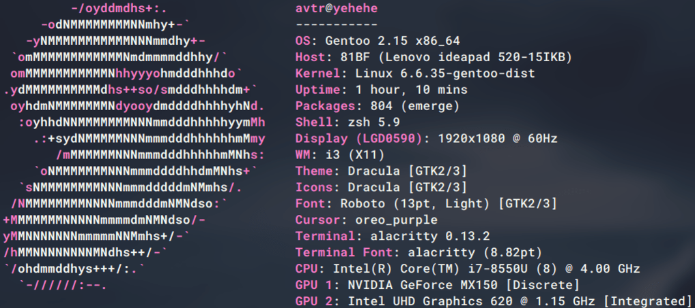

# Gentoo/X11/i3 avtr's .dotfiles
## Depencencies
```bash
sudo emerge dev-vcs/git, app-admin/stow
```
---

<p align="center">

</p>

--- 
## Installation

### Clone
```bash
git clone https://github.com/hyperavtr/.dotfiles.git && cd .dotfiles
```
---
 #### Specific folder
 >`Example for making symlinks only for i3 configuration.` If you want to make symlinks from specific folder just cd there and use commands below.
 ```bash
 cd $HOME/.dotfiles/home/dot-config/i3
 ```
 ---
 >Warning! This behaviour is specifically intended to alter the contents of your stow directory(mix, if files do exist in the symlinks destinations - **stow directory** would be overwritten with this files). If you do not want that, this option is not for you `--adopt`. Simulate at first if you want `sudo stow --adopt -nvt / .`

 ```bash
sudo stow --adopt -vt / .
``` 
>Or safe for cloned stow directory(pure). Simulation is recommended `sudo stow -nvt / .`. 

```bash
sudo stow -vt / .
```
 ---
#### root

```bash
cd $HOME/.dotfiles/root
```
---
 >Warning! This behaviour is specifically intended to alter the contents of your stow directory(mix, if files do exist in the symlinks destinations - **stow directory** would be overwritten with this files). If you do not want that, this option is not for you `--adopt`. Simulate at first if you want `sudo stow --adopt -nvt / .`

 ```bash
sudo stow --adopt -vt / .
``` 
>Or safe for cloned stow directory(pure). Simulation is recommended `sudo stow -nvt / .`. 

```bash
sudo stow -vt / .
```
>After you're done with the symlinks

```bash
su - root
```
```bash
chown root:root /etc/sudoers && exit
```
```bash
usermod -a -G root,tty,wheel,cron,audio,video,usb,input,users,portage,plugdev,gamemode,pipewire $USER
```
>Check just in case.
```bash
$USER groups
```
---

#### home

```bash
cd $HOME/.dotfiles/home
```
---
>Warning! This behaviour is specifically intended to alter the contents of your stow directory(mix, if files do exist in the symlinks destinations - **stow directory** would be overwritten with this files). If you do not want that, this option is not for you `--adopt`. Simulate at first if you want `stow --adopt --dotfiles -nvt ~ .`

```bash
stow --adopt --dotfiles -vt ~ .
```
>Or safe for cloned stow directory(pure). Simulation is recommended `sudo stow -nvt / .`. 

```bash
stow --dotfiles -vt ~ .
```
---

## Uninstallation
#### Specific folder
>`Example for removing symlinks only for i3 configuration.`

 ```bash
 cd $HOME/.dotfiles/home/dot-config/i3
 ```
---
>Simulation is recommended `sudo stow -nDvt / .`.

```bash
sudo stow -Dvt / .
```
---

#### root

```bash
cd $HOME/.dotfiles/root
```
---
>Simulation is recommended `sudo stow -nDvt / .`.

```bash
sudo stow -Dvt / .
```
---

#### home

```bash
cd $HOME/.dotfiles/home
```
---
>Simulation is recommended `stow --dotfiles -nDvt ~ .`.

```bash
stow --dotfiles -Dvt ~ .
```
---
